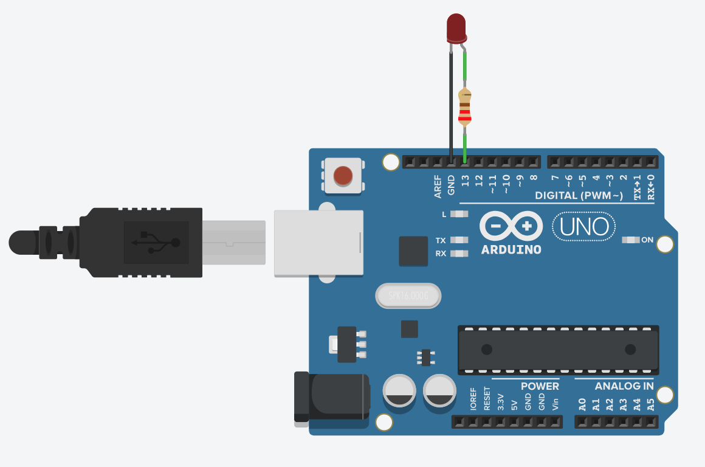

# Morse thing

## Scope of the work
Implement I/O for micro-controller.

## Tasks
Make an Adruino program that reads text from Serial and encodes it into Morse Code. Show this Morse Code with builtin LED/buzzer.

## Materials
Arduino Nano V3, laptop with IDE and buzzer.

## Algorithm
Read byte from serial. Find the index of the character. Map the index to its respective morse string. Loop to the morse string and write LOW or HIGH on the LED pin and delay depending if it's a dot or a dash.

## Theory
Arduino is micro-controller(rather a micro-computer) that can communicate with your laptop via USB cable. Standard library has a Serial object the can be used for that.
Serial object has the following methods:
• `begin(int baudrate)` sets up the serial communication with a baudrate. Needs to be called before other methods are called.
• `available()` returns amount of bytes ready to be read from the serial port. • .read() reads and returns one byte from the serial port buffer.

## Conclusion
Nothing fancy in this lab.

The code can be found in [this](./main.ino) file.
