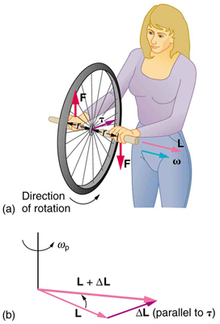
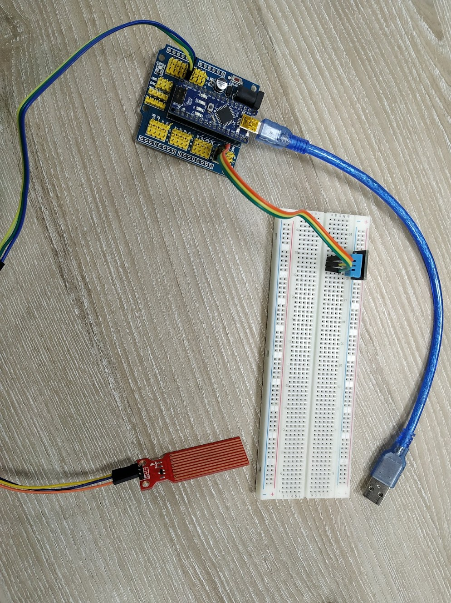

# Gyroscope sensor

Gyroscope sensor is a device that can measure and maintain the orientation and angular velocity of an object. These are more advanced than accelerometers. These can measure the tilt and lateral orientation of the object whereas accelerometer can only measure the linear motion.

Measured in degrees per second, angular velocity is the change in the rotational angle of the object per unit of time.

Some Gyroscope sensor uses the **[Gyroscope Effect](https://courses.lumenlearning.com/physics/chapter/10-7-gyroscopic-effects-vector-aspects-of-angular-momentum/)**.

Basically, it has a small wheel inside that continuously rotates. By changing its position, we can calculate the difference using the Angular Momentum.

This force can be noticed when we try to hold a rotating wheel. We should feel how the gyroscopic momentum holds the wheel from falling, until it slows down.

By having 2 such sensors, we can easily measure the angular rotation on the X and Y axis.

## Applications
Applications of gyroscopes include inertial navigation systems, such as in the Hubble Telescope, or inside the steel hull of a submerged submarine. Due to their precision, gyroscopes are also used in gyrotheodolites to maintain direction in tunnel mining. Gyroscopes can be used to construct gyrocompasses, which complement or replace magnetic compasses (in ships, aircraft and spacecraft, vehicles in general), to assist in stability (bicycles, motorcycles, and ships) or be used as part of an inertial guidance system.

# The practical task

For this laboratory task we had to implement a system to display the water level and the temperature.

- for the Water level, we've used the water level sensor
- for the temperature, we've used the DHT11 sensor (Temperature and Humidity sensor)

## The actual Arduino thing

