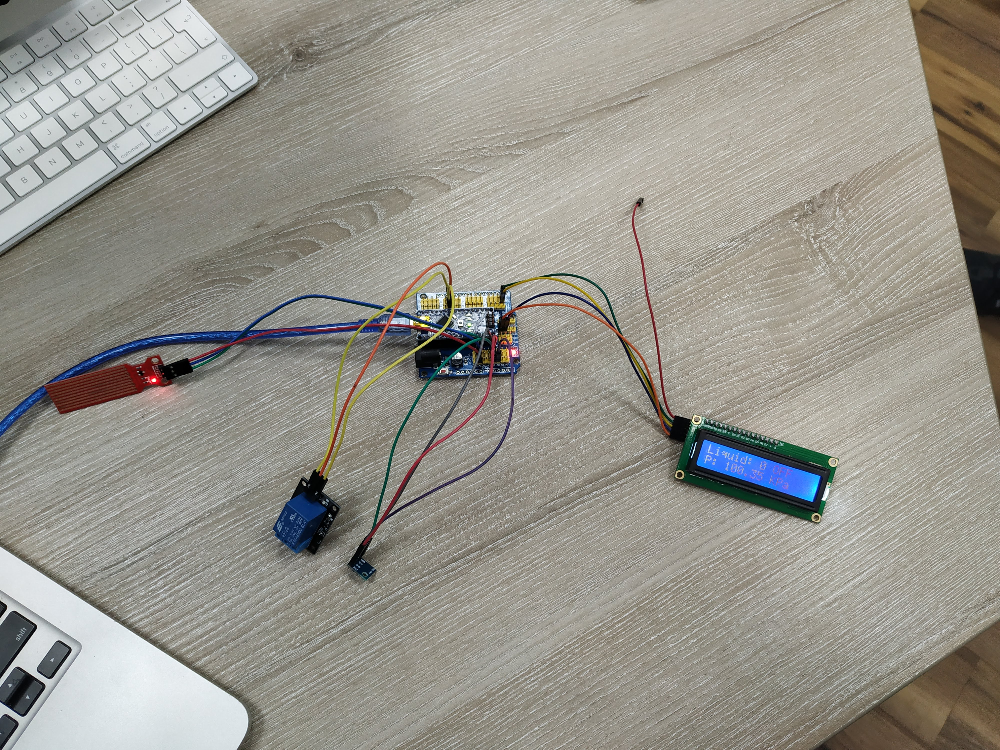

# LCD Thing

## Components

 - Arduino board
 - LCD
 - Relay
 - Water Level Sensor
 - BMP085 sensor

## Task

In this laboratory work we had to implement a system to display the water level, pressure and the relay's state on the LCD display.

* For the pressure, we've used the BMP085 Adafruit sensor.
* For the LCD display, we've used a mini adapter.

## Theory

### I2C
w

### SPI (Serial Peripheral Interface)
w
