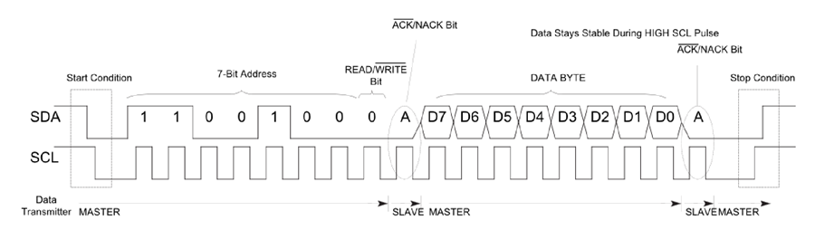

# Communication interfaces

## Scope of the work
Understanding the communication interfaces

## Objectives
  * How to use I2C
  * Interact with sensors via I2C

## Tasks
Using the system implemented in the previous lab, add a way to display data on an LDC16x02 connected via
interface I2C.
Also connect one pressure sensor to the same I2C interface.

All the sensor data should be displayed on the LCD.

## Available materials
  * Arduino Nano v3.0 (Atmega328p)
  * SRD-05VDC
  * 5v electric pump
  * Water level sensors
  * LCD16x02
  * atmospheric pressure sensor

## Theory

### I2C
I2C is a serial protocol that lets multiple low power devices connect to each other, via one two-wire bus. It is very simple to use.

As shown on the figure above, I2C uses only two wires: SCL (serial clock) and SDA (serial data). There is master and several slaves. Transfer from master to slave is serial and split into 8 bit packets. Basic I2C communication is using transfers of 8 bits. Each I2C slave has a unique 7 bit address that needs to be unique on the bus. The address is contained in bits from 7 to 1, while the bit 0 determines whether the slave is read from or written to. Normally the SDA changes only when SCL is low, the exception are start and stop conditions. The transmission starts with the start condition followed by 7 bit address and read or write bit. The slave device sends the acknowledge bit, then the transmission begins until it hits the stop condition.

### SPI
The Serial Peripheral Interface is a synchronous serial communication interface.

It uses 4 signals/writes:
  1. SCLK: Serial clock (output from master)
  2. MOSI: Master Output Slave Input, or Master Out Slave in (output from master)
  3. MISO: Master Input Slave Output, or Master In Slave Out (data output from slave)
  4. SS: Slave select (often active low, output from master)

It operates in full duplex mode using master-slave architecture. There can be only one master and several slaves.

To begin the communication, the master configures the clock, using the frequency supported by the slave device. The master then selects the slave device with logic level 0 on the select line. During each SPI clock cycle, a full-duplex data transmission occurs. The master sends a bit on the MOSI line and the slave reads it, while the slave sends a bit on the MISO lines and the master reads it. This sequence is maintained even when only one-directional data transfer is intended.

Transmission normally involves two shift registers of some word-size, like 8 bits, one on master and on the slave, which are connected in a virtual ring topology, as shown on figure 3, maybe. Master and slave continuously exchange the contents of their registers. If more data needs to be exchanged, the registers are reset and the cycle repeats. When complete, the master stops toggling the clock signal and deselects the slave.

## Implementation

## Conclusions

In this laboratory work I've learned about I2C and SPI.

I've learned when to buy I2C or SPI controllers. I2C is not as fast as SPI, but it allows connecting more slaves. So, I2C is a good idea when we have some controllers that send a few bytes once a day or so.
