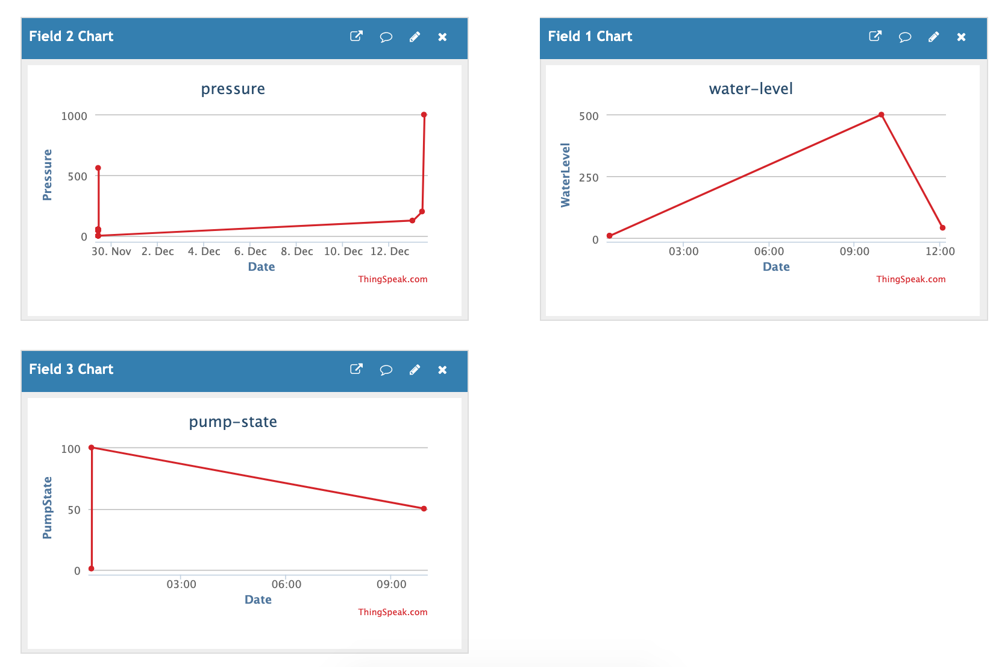
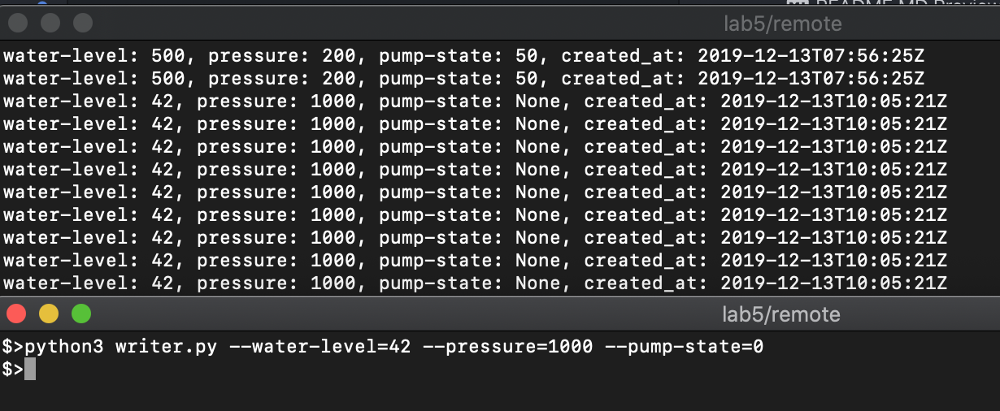
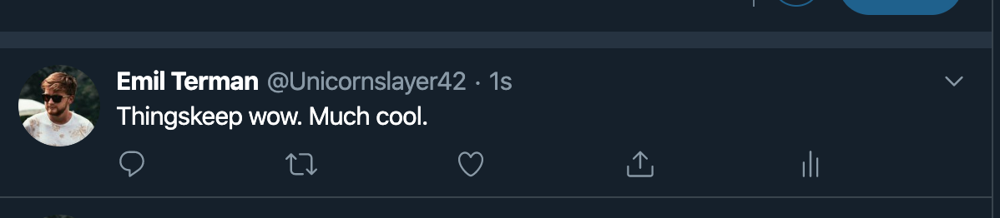

# Communication interfaces

## Scope of the work
Interaction with IoT Cloud.

## Objectives
  * Interact with ThingSpeak platform
  * Automatic upload of data to the server
  * Parsing the data from the platform Integrate the data with an application

## Tasks
Create account on ThingsPeak. Create one channel with 4 fields, that describes the system in the last laboratory work. Make a script that simulates automatic publishing of the data on this channel and one script that fetches and parses the data from the cloud.

## Available materials
  * https://thingspeak.com/

## Implementation
I made 2 python scripts: reader and writer.

The reader continuously prints the last feed, continuously, every 5 seconds.

The writer allows writing data to ThingSpeak through program arguments.

