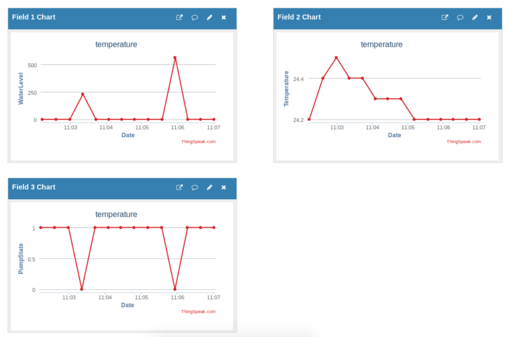

# Communication interfaces

## Scope of the work
Implement and integrate system created in labs 1-4 with IoT Cloud.

## Objectives
  * Interact with baord WEMOS LOLIN ESP32
  * Connect to 802.11 network
  * Uplad data to Cloud

## Tasks
Make your board connect to 802.11 network. Connect sensors and actuators from the previous labs to it. Integrate it with the cloud.

## Available materials
WEMOS LOLIN32 ESP 32, Water level sensor, DTH11 temperature & humidity sensor, relay, pump, wires.

## Implementation

I used a WiFi library to connect and use 802.11 network. I hardcoded SSID and password of the WiFi strings and just called `WiFi.begin(ssid, password)`. Then I used HTTPClient class to send a http request to the cloud with the data I’ve collected from the sensors.

